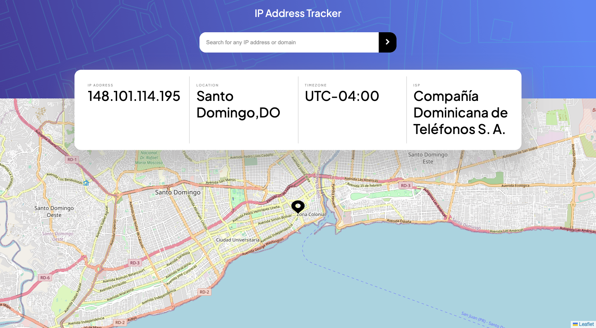

# Frontend Mentor - IP address tracker solution

This is a solution to the [IP address tracker challenge on Frontend Mentor](https://www.frontendmentor.io/challenges/ip-address-tracker-I8-0yYAH0). Frontend Mentor challenges help you improve your coding skills by building realistic projects. 

## Table of contents

- [Overview](#overview)
  - [The challenge](#the-challenge)
  - [Screenshot](#screenshot)
  - [Links](#links)
- [My process](#my-process)
  - [Built with](#built-with)
  - [What I learned](#what-i-learned)
  - [Continued development](#continued-development)

## Overview

### The challenge

Users should be able to:

- View the optimal layout for each page depending on their device's screen size
- See hover states for all interactive elements on the page
- See their own IP address on the map on the initial page load
- Search for any IP addresses or domains and see the key information and location

### Screenshot



Screenshot of the app at initial page load

### Links

- Solution URL: https://github.com/Perlishnov/ip-address-tracker-master
- Live Site URL: https://ip-address-tracker-master-perlishnov.vercel.app/

## My process

### Built with

- Semantic HTML5 markup
- CSS custom properties
- Flexbox
- CSS Grid
- Mobile-first workflow
- ES6 Javascript
- Asynchronous javascript
- [Leaflet.js](https://leafletjs.com/) - Map library
- [Ipfy](https://geo.ipify.org/) - IP Geolocation API

### What I learned

- How to use the Leaflet.js library to create interactive maps in web applications.
```js
var map = L.map("map", { zoomControl: false }).setView([0, 0], 13);
L.tileLayer("https://tile.openstreetmap.org/{z}/{x}/{y}.png", {
  maxZoom: 49,
}).addTo(map);
```
- Fetching data from external APIs and handling the response using async/await, allowing for more efficient and readable asynchronous code.
```js
async function GetUserIP() {
  await fetch("https://api.ipify.org?format=json")
    .then((response) => response.json())
    .then((data) => showUserData(data.ip));
}

// Fetch ip info function
async function fetchIPAdressInfo(ipAddress) {
  let data;
  await fetch(
    `https://geo.ipify.org/api/v2/country,city?apiKey=at_QUWwggAu1RxD88ono9IwPfHgxt6jc&ipAddress=${ipAddress}`
  ).then((response) => {
    data = response.json();
  });
  return data;
}

```
- Creating custom map markers using Leaflet's L.icon.
```js

//Creating custom icon
var customIcon = L.icon({
  iconUrl: "./images/icon-location.svg",
  iconSize: [32, 32],
  iconAnchor: [16, 32],
});
// Adding custom icon to the map
var marker = L.marker([0, 0], {
  icon: customIcon,
}).addTo(map);
```
- Working with HTML and CSS to create a responsive and visually appealing design.

### Continued development

I think I should improve my CSS skills. I think the code could a lot simpler and shorter. Also, I think I brush my knowledge about semantic HTML
